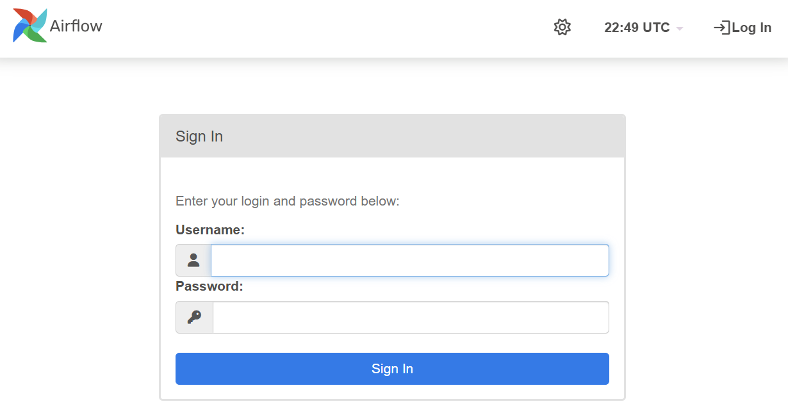
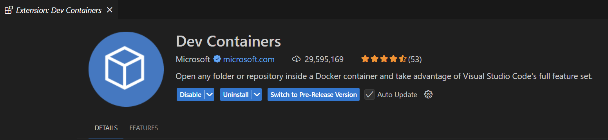

# ⚡ Airflow Quickstart - Versión 2.10.5

## 📝 Descripción

Este entorno de `quickstart-airflow` está diseñado para facilitar la instalación y configuración rápida de Apache Airflow en Windows utilizando Docker. Está basado en la versión **2.10.5** de Apache Airflow y permite experimentar con DAGs personalizados o con los ejemplos predeterminados de Airflow.

> [!IMPORTANT]
> Este entorno es únicamente para fines de experimentación y aprendizaje. No debe ser utilizado en entornos de producción.


## 📑 Tabla de Contenidos

- [📝 Descripción](#-descripción)
- [🛠️ Requisitos Previos](#%EF%B8%8F-requisitos-previos)
- [📂 Estructura de Carpetas](#-estructura-de-carpetas)
- [🚦 Configuración Inicial](#-configuración-inicial)
- [▶️ Iniciar el Entorno de Apache Airflow](#️%EF%B8%8F%EF%B8%8F-iniciar-el-entorno-de-apache-airflow)
- [📋 Mensajes de Éxito Esperados](#-mensajes-de-éxito-esperados)
- [✅ Verificar el Estado de los Servicios](#-verificar-el-estado-de-los-servicios)
- [🌐 Acceder a la Interfaz Web](#-acceder-a-la-interfaz-web)
- [🛑 Detener el Entorno](#-detener-el-entorno)
- [🧹 Eliminar Contenedores y Volúmenes](#-eliminar-contenedores-y-volúmenes)
- [💻 Uso de VSCode con Dev Containers](#-uso-de-vscode-con-dev-containers)
  - [🔧 Requisitos Previos](#️-requisitos-previos)
  - [⚙️ Pasos para Configurar el Dev Container](#️%EF%B8%8F-pasos-para-configurar-el-dev-container)


## 🛠️ Requisitos Previos

- Tener **Docker** y **Docker Compose** instalados en tu PC. (Docker Desktop ya incluye Docker Compose).

Si aun no lo tienes dirigete a [Docker Desktop](https://www.docker.com/products/docker-desktop) y sigue las instrucciones de instalación según tu sistema operativo.


## 📂 Estructura de Carpetas

```
quickstart-airflow/
├─ dags/                        # Ejemplos de DAGs
│   ├─ dag_hello_world.py       # Ejemplo básico con PythonOperator
│   ├─ dag_bash_operator.py     # Ejemplo con BashOperator
│   ├─ dag_dependencies.py      # Ejemplo con dependencias entre tareas
│   └─ README.md                # Cómo usar VSCode con Dev Containers
|
├─ plugins/               # Plugins personalizados (si son necesarios)
├─ config/                # Archivos de configuración (en gitignore)
├─ logs/                  # Carpeta de logs (en gitignore)
├─ docker-compose.yaml    # Archivo de configuración Docker
├─ Dockerfile             # Archivo básico de docker para airflow
├─ .env                   # Variables de entorno necesarias
└─ README.md              # Instrucciones detalladas del quickstart
```

> [!NOTE]
> Las carpetas `plugins`, `config`, `logs` y el archivo `.env` no están presentes en el repositorio debido a que:
> - `plugins/`, `config/`, y `logs/` deben ser generados localmente antes de iniciar el entorno.
> - `.env` contiene información de configuración específica del entorno local.  
> Estos elementos están incluidos en el `.gitignore` para evitar problemas de seguridad y asegurar una configuración adecuada en cada entorno.


## 🚦 Configuración Inicial

1. Navega a la carpeta `quickstart-airflow`:

```bash
cd workspace/quickstart-airflow
```

2. Crea las carpetas necesarias y el archivo `.env`:
   
```bash
mkdir dags plugins config logs

# Crear el archivo .env con el ID de usuario para evitar warnings
echo "AIRFLOW_UID=50000" > .env
```

3. Configura la carga de ejemplos de Apache Airflow:

En el archivo `docker-compose.yaml`, puedes habilitar o deshabilitar la carga de DAGs de ejemplo cambiando el valor de la variable `AIRFLOW__CORE__LOAD_EXAMPLES`:

```yaml
AIRFLOW__CORE__LOAD_EXAMPLES: 'true' # Cambia a 'false' para no cargar ejemplos
```


## ▶️ Iniciar el Entorno de Apache Airflow

Ejecuta el siguiente comando para inicializar Apache Airflow:
```bash
# Inicializar la base de datos y servicios
docker compose up airflow-init
```
> [!NOTE]
> Solo es necesario ejecutar este comando la primera vez que inicializas el entorno.

Ejecuta el siguiente comando para ejecutar Apache Airflow :
```bash
# Iniciar todos los servicios en segundo plano
docker compose up -d
```

>[!TIP] 
> Utilice la bandera `-d` o `--detach` para ejecutar el compose de Apache Airflow en segundo plano y tener una terminal mas limpia.


## 📋 Mensajes de Éxito Esperados

Durante la inicialización, deberías ver mensajes como:

- `airflow-init-1  | User "airflow" created with role "Admin"` (Indica que el se ha creado el usuario predeterminado correctamente)
- `airflow-init-1  | 2.10.5` (Indica la versión utilizada de Apache Airflow)
- `airflow-init-1 exited with code 0` (La inicialización ha sido exitosa)

Si todo está en orden, podrás acceder a la interfaz web y ver los DAGs cargados.


## ✅ Verificar el Estado de los Servicios

Si la interfaz web no se carga, ejecuta el siguiente comando para verificar el estado de los contenedores:

```bash
docker ps
```

y debería de verse algo como esto:
```bash
CONTAINER ID   IMAGE                   COMMAND                  CREATED          STATUS                    PORTS                              NAMES
247ebe6cf87a   apache/airflow:2.10.5   "/usr/bin/dumb-init …"   3 minutes ago    Up 3 minutes (healthy)    8080/tcp                           compose_airflow-worker_1
ed9b09fc84b1   apache/airflow:2.10.5   "/usr/bin/dumb-init …"   3 minutes ago    Up 3 minutes (healthy)    8080/tcp                           compose_airflow-scheduler_1
7cb1fb603a98   apache/airflow:2.10.5   "/usr/bin/dumb-init …"   3 minutes ago    Up 3 minutes (healthy)    0.0.0.0:8080->8080/tcp             compose_airflow-webserver_1
74f3bbe506eb   postgres:13             "docker-entrypoint.s…"   18 minutes ago   Up 17 minutes (healthy)   5432/tcp                           compose_postgres_1
0bd6576d23cb   redis:latest            "docker-entrypoint.s…"   10 hours ago     Up 17 minutes (healthy)   0.0.0.0:6379->6379/tcp             compose_redis_1
```

Asegúrate de que todos los servicios estén en estado **healthy**.


## 🌐 Acceder a la Interfaz Web

1. Abre tu navegador y dirígete a:

[http://localhost:8080](http://localhost:8080)

2. Inicia sesión con las credenciales predeterminadas:

- **Usuario:** airflow
- **Contraseña:** airflow

Deberías de ver algo como esto:


## 🛑 Detener el Entorno

Para detener la ejecución del entorno utiliza el siguiente comando:
```bash
docker compose down
```          


## 🧹 Eliminar Contenedores y Volúmenes

- Si quieres empezar desde 0 otra vez, ejecuta el siguiente comando:
```bash
docker compose down --volumes --remove-orphans
```          
> [!CAUTION] 
> Esto eliminará todos los volúmenes y datos almacenados, listo para empezar de nuevo.


- Si ya no necesitas el entorno y deseas limpiar todos los contenedores y volúmenes asociados, ejecuta el siguiente comando:
```bash
docker compose down --volumes --remove-orphans --rmi all
```
>[!CAUTION] 
> Esto eliminará todos los volúmenes, datos almacenados e imágenes descargadas.


## 💻 Uso de VSCode con Dev Containers

> [!TIP]
> Para tener una mejor experiencia desarrollando DAGs, sigue los pasos a continuación para utilizar la extensión de `Dev Containers` de *VSCode* para poder tener acceso a Airflow dentro del entorno de Docker.

### 📌 Requisitos Previos

1. **Docker Desktop:** Instalar Docker desde [Docker Hub](https://www.docker.com/products/docker-desktop).
2. **Visual Studio Code (VS Code):** Descargar desde [Visual Studio Code](https://code.visualstudio.com/).
3. **Extensión Dev Containers:** Instalar la extensión oficial de Microsoft: `Dev Containers` en VS Code.
   

4. **Archivo `docker-compose.yaml` oficial de Apache Airflow:** Descargable desde el [repositorio oficial](https://github.com/apache/airflow).

### ⚙️ Pasos para Configurar el Dev Container

1. **Crear un Dockerfile:** En el mismo directorio donde está el `docker-compose.yaml`, crea un archivo `Dockerfile` con el siguiente contenido mínimo:
> [!NOTE]
> Esto es unicamente para facilitarnos el proceso de creacion de la conexión remota.


```dockerfile
FROM apache/airflow:<version>
# Ejemplo: FROM apache/airflow:2.10.5-python3.8
```

1. **Agregar Configuración de Dev Container:**
   - Abre VS Code y navega a la paleta de comandos (`Ctrl + Shift + P`).
   - Escribe `Dev Containers: Add Development Container Configuration Files`.
   - Selecciona `Add configuration to workspace` para crear en el directorio de trabajo la carpeta de configuraciones
   - Selecciona `From Dockerfile` y elige elementos adicionales si lo deseas o solo da en `ok`.
  

2. **Reabrir en el Contenedor:**
   - Nuevamente, usa `Ctrl + Shift + P`, escribe `Dev Containers: Reopen in Container` y selecciónalo.
   - VS Code construirá el contenedor y se abrirá en una nueva ventana.
> [!IMPORTANT]
> El proceso puede tardar unos minutos en lo que se descargan los elementos necesarios para la conexión remota.


3. **Instalar la Extensión de Python:**
   - Abre el panel de extensiones en VS Code, busca `Python` y selecciona `Install in Dev Container` para habilitar el Intellisense.

4. **Seleccionar el Intérprete de Python:**
   - Haz clic en la barra inferior izquierda (`Select Python Interpreter`) y elige el intérprete del entorno Docker (En este caso python 3.8).

5. **Abrir una Terminal Local:**
   - Usa `Ctrl + Shift + P` y selecciona `Create New Integrated Terminal (Local)`.
> [!TIP]
> Este paso es opcional si quieres tener acceso a una terminal de tu máquina local y no del contenedor, pero es muy útil para reiniciar el contenedor del webserver para actualizar la vista de los DAGs en la UI de Airflow.

6. **Cerrar el Dev Container:**
   - Para salir del entorno, usa `Ctrl + Shift + P`, busca `Close Dev Container` y seleccionaló.

> [!NOTE]
> Si lo deseas, también puedes ignorar los mensajes de advertencia sin que afecte el funcionamiento de Airflow.