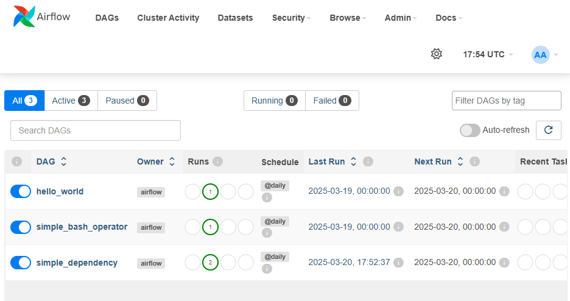
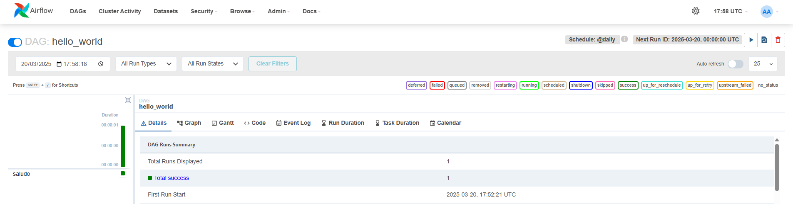
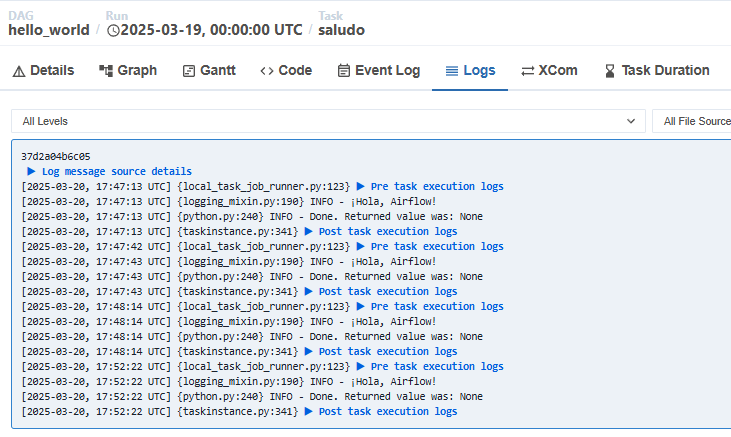

# 📊 DAGs Básicos en Apache Airflow

## 📝 Descripción

En esta carpeta encontrarás ejemplos de **DAGs** (Directed Acyclic Graphs) básicos diseñados para principiantes en Apache Airflow. Estos DAGs son ideales para aprender y experimentar con los conceptos fundamentales de la automatización de flujos de trabajo.


## 📑 Tabla de Contenidos

- [📝 Descripción](#-descripción)
- [🧠 ¿Qué es un DAG en Airflow?](#-qué-es-un-dag-en-airflow?)
- [⚙️ Estructura de un DAG](#%EF%B8%8F-estructura-de-un-dag)
- [🛠️ DAGs Incluidos](#%EF%B8%8F-dags-incluidos)
- [🚀 Cómo Usar los DAGs](#-cómo-usar-los-dags)
- [🔗 Referencias](#-referencias)


## 🧠 ¿Qué es un DAG en Airflow?

Un **DAG (Directed Acyclic Graph)** en Apache Airflow es una colección de tareas organizadas de forma que se ejecuten en un orden específico y sin ciclos. Los DAGs permiten automatizar procesos complejos dividiéndolos en tareas individuales conectadas entre sí.

### Componentes Principales de un DAG

- **Tareas (Tasks):** Unidades individuales de trabajo (e.g., ejecutar un script, mover datos, realizar cálculos).
- **Operadores (Operators):** Definen la acción de cada tarea (e.g., `PythonOperator`, `BashOperator`).
- **Dependencias:** Relaciones que dictan el orden de ejecución de las tareas.
- **Programación (Scheduling):** Define cuándo y con qué frecuencia se ejecutará el DAG.


## ⚙️ Estructura de un DAG

```python
from airflow import DAG
from airflow.operators.python import PythonOperator
from datetime import datetime

def mi_tarea():
    print('¡Hola, Airflow!')

with DAG('mi_primer_dag',
         start_date=datetime(2025, 1, 1),
         schedule_interval='@daily',
         catchup=False) as dag:
    tarea = PythonOperator(
        task_id='saludo',
        python_callable=mi_tarea
    )
```

- **DAG:** Define el flujo de trabajo y su programación.
- **PythonOperator:** Ejecuta una función de Python como tarea.
- **Dependencias:** Se pueden definir usando `tarea1 >> tarea2` o `tarea1.set_downstream(tarea2)`.


## 🛠️ DAGs Incluidos

### 1. **DAG Hola Mundo** (`dag_hello_world.py`)

- **Propósito:** Muestra un simple saludo en la consola.
- **Operador Utilizado:** `PythonOperator`
- **Código Principal:**
```python
print('¡Hola, Airflow!')
```

### 2. **DAG con BashOperator** (`dag_bash_operator.py`)

- **Propósito:** Ejecuta un comando Bash dentro del contenedor.
- **Operador Utilizado:** `BashOperator`
- **Código Principal:**
```bash
echo 'Este es un comando Bash ejecutado desde Airflow'
```

### 3. **DAG con Dependencias** (`dag_dependencies.py`)

- **Propósito:** Muestra cómo establecer dependencias entre tareas.
- **Tareas:**
  - `inicio`: Imprime un mensaje de inicio.
  - `proceso`: Simula un proceso intermedio.
  - `fin`: Indica la finalización del flujo de trabajo.
- **Dependencias:** `inicio >> proceso >> fin`


## 🚀 Cómo Usar los DAGs

1. Copia los archivos `.py` de los DAGs en la carpeta `dags` de tu entorno de `airflow-quickstart`.

```bash
cp dags/*.py /ruta/a/airflow-quickstart/dags
```


2. Reinicia el servidor de Airflow para cargar los nuevos DAGs.

```bash
docker compose restart airflow-webserver
```


3. Accede a la interfaz web de Airflow en [http://localhost:8080](http://localhost:8080) y verifica que los DAGs aparezcan como activos.
    	
    Deberías de poder ver alg como esto en tu interfaz web

    


4. Prueba ejecutar un DAG con la interfaz y comprueba su funcionamiento, para lograrlo navega a cualquiera de los DAGs y presiona el botón de run

    

    Luego ve a la ventana de graph, selecciona la tarea que deseas verificar y visita logs, ahi deberias de ver la ejecución del DAG
    


## 🔗 Referencias
Para mas información puedes visitar la siguiente documentación:

- [Documentación Oficial de Apache Airflow](https://airflow.apache.org/)
- [Guía de Operadores en Airflow](https://airflow.apache.org/docs/apache-airflow/stable/howto/operator/index.html)

