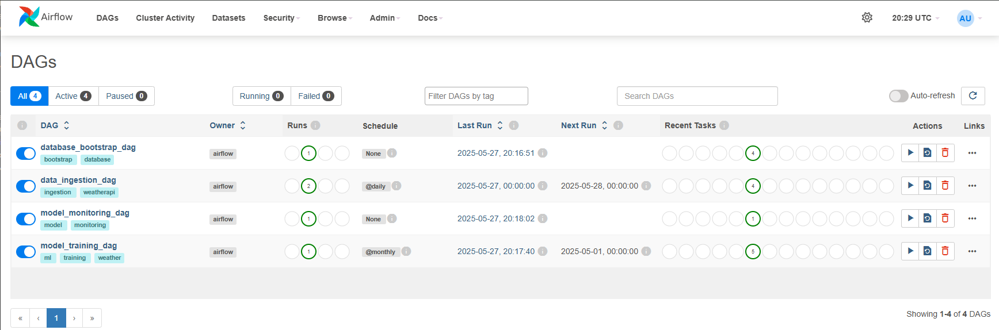
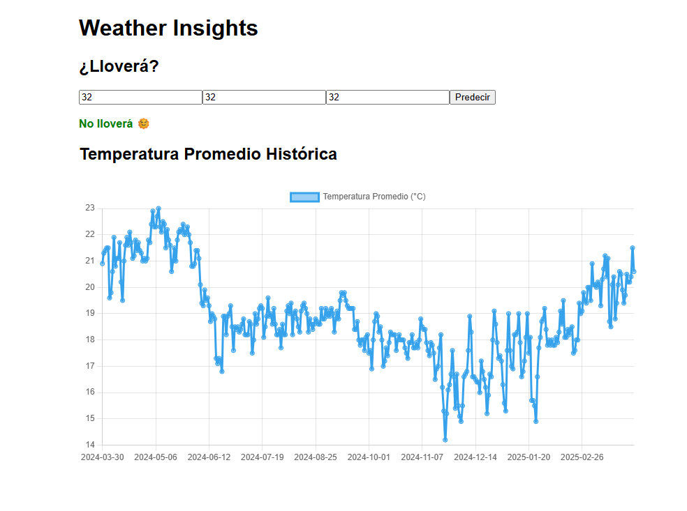
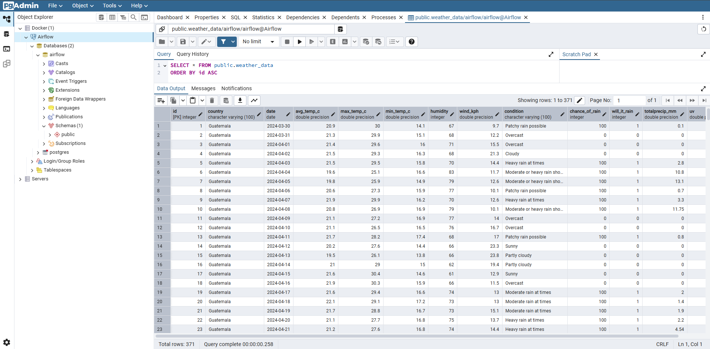

# 🌦️ Weather Pipeline – Sistema de Predicción y Monitoreo Climático

## 📝 Descripción

**Weather Pipeline** es un sistema completo de predicción meteorológica que combina:

* **Airflow** para la automatización del flujo de datos.
* **Machine Learning** para la predicción de lluvia.
* **FastAPI + React** para ofrecer una interfaz de consulta sencilla.
* **PostgreSQL** como sistema de almacenamiento central.
* **pgAdmin** (opcional) para explorar la base de datos vía GUI.

Este proyecto fue diseñado para ejecutarse completamente en contenedores Docker, permitiendo una configuración reproducible y escalable.

## 📑 Tabla de Contenidos

* [📝 Descripción](#-descripción)
* [📁 Estructura del Proyecto](#-estructura-del-proyecto)
* [🚀 Pasos de Configuración Inicial](#-pasos-de-configuración-inicial)
* [🐳 Levantar los Contenedores](#-levantar-los-contenedores)
* [🔗 Acceder a los Servicios](#-acceder-a-los-servicios)
* [🖼️ Vista previa](#️-vista-previa)

## 📁 Estructura del Proyecto

```text
weather-pipeline/
├── airflow/                  # Contenedor de Airflow
│   ├── dags/                # DAGs y su README
│   ├── data/                # CSV inicial
│   ├── logs/                # (Debe crearse manualmente)
│   ├── pgadmin/             # Configuración opcional para pgAdmin
│   ├── scripts/             # Scripts utilitarios para DAGs
│   ├── Dockerfile           # Imagen extendida con dependencias
│   ├── requirements.txt     # Dependencias para los DAGs
│   └── variables.json       # Variables iniciales para Airflow (ej. API KEY)
├── app/                     # Contenedor de la mini app (API + UI)
│   ├── backend/
│   ├── frontend/
│   ├── Dockerfile
│   ├── requirements.txt
│   └── README.md            # Documentación de la mini app
├── shared/                  # Recursos compartidos entre contenedores
│   └── models/              # Modelos .pkl generados por Airflow (read-only para app)
├── src/                     # Scripts generales de preparación
│   ├── scripts/
│   ├── requirements.txt
│   └── README.md
├── screenshots/             # Capturas de pantalla del sistema
├── docker-compose.yaml      # Orquestación completa del sistema
├── .env                     # Variables de entorno globales (AIRFLOW_UID)
└── README.md                # Este archivo
```

## 🚀 Pasos de Configuración Inicial

### 0. Moverse al directorio principal del proyecto

Desde la raíz del repositorio clonado:

```bash
cd weather-pipeline
```

### 1. Crear archivo `.env` en la raíz del proyecto

```env
AIRFLOW_UID=50000
```

Esto previene errores de permisos con volúmenes montados en Airflow.

---

### 2. Crear entorno virtual y ejecutar scripts iniciales

```bash
cd weather-pipeline
python -m venv venv
source venv/bin/activate  # (o .\venv\Scripts\activate en Windows)
pip install -r src/scripts/requirements.txt
```

#### a. Ejecutar `dataset_creator.py`

```bash
python src/scripts/dataset_creator.py
```

Este script generará el archivo `airflow/data/weather_data.csv` con datos del último año. Puedes modificar el rango cambiando las constantes `START_DATE` y `END_DATE` dentro del script.

#### b. Ejecutar `gen_fernet_key.py`

```bash
python src/scripts/gen_fernet_key.py
```

Este script generará y almacenará la clave `AIRFLOW__CORE__FERNET_KEY` en tu `.env`, necesaria para que Airflow encripte conexiones y variables. Te preguntará si deseas sobrescribirla si ya existe.

### 3. Crear archivo `variables.json` en `airflow/`

Este archivo debe contener tu clave de WeatherAPI:

```json
{
  "WEATHER_API_KEY": "aquí-tu-api-key"
}
```

Al iniciar el contenedor de Airflow, esta clave se cargará automáticamente como Variable en el entorno.

### 4. Crear carpeta `logs/` en `airflow/`

```bash
mkdir airflow/logs
```

Es necesaria para que Airflow pueda almacenar los logs de ejecución de tareas.

### 5. (Opcional) Editar `pgadmin/servers.json`

Este archivo configura pgAdmin para que se conecte automáticamente a la base de datos de Airflow. Puedes personalizar `"Name"` o `"Group"`, pero **no cambies el `"Port"`**, a menos que también lo cambies en `docker-compose.yaml`.

```json
{
  "Servers": {
    "1": {
      "Name": "Airflow",
      "Group": "Docker",
      "Host": "postgres",
      "Port": 5432,
      "MaintenanceDB": "airflow",
      "Username": "airflow",
      "SSLMode": "prefer"
    }
  }
}
```

## 🐳 Levantar los Contenedores

Una vez listo todo lo anterior:

### Paso 1 – Inicializar Airflow

```bash
docker compose up airflow-init
```

> [!IMPORTANT]
> Este paso prepara las configuraciones y servicios internos de Airflow y carga las variables.

### Paso 2 – Levantar servicios

```bash
docker compose up -d
```

> [!IMPORTANT]
> Este paso crea y levanta los servicios en segundo plano.

### Paso 3 – Verificar estado

```bash
docker ps
```

> [!INFO]
> Asegúrate que los contenedores no estén en `starting`. Espera si es necesario.

## 🔗 Acceder a los Servicios

* **Airflow**
  URL: [http://localhost:8080](http://localhost:8080)
  Usuario: `airflow`
  Contraseña: `airflow`

* **Mini App (Predicción y visualización)**
  URL: [http://localhost:8000](http://localhost:8000)
  No requiere autenticación.

* **pgAdmin (Opcional)**
  URL: [http://localhost:5050](http://localhost:5050)
  Al ingresar por primera vez, se solicitará la contraseña del usuario `admin`. Esta es: `admin`. Puedes marcar la opción para guardar la contraseña.

## 🖼️ Vista previa

A continuación vistas previas de los servicios disponibles:

* 
* 
* 
